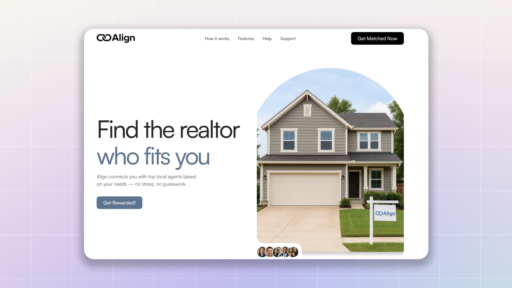
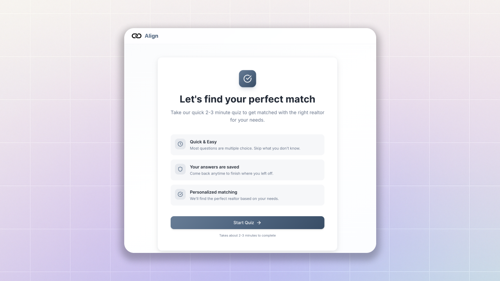
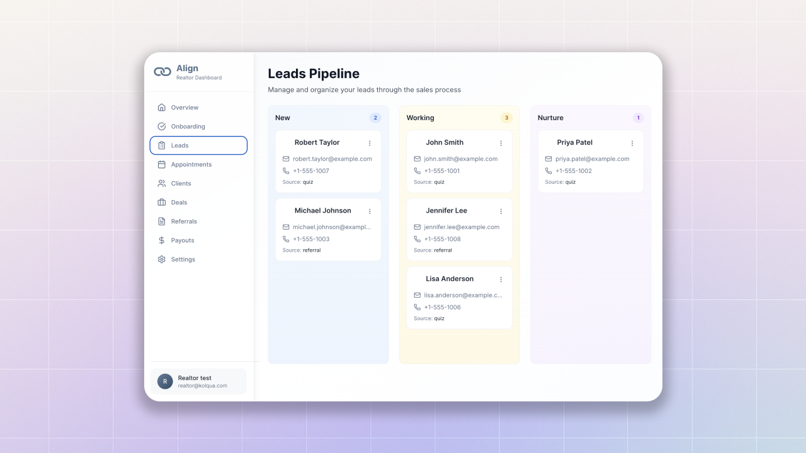
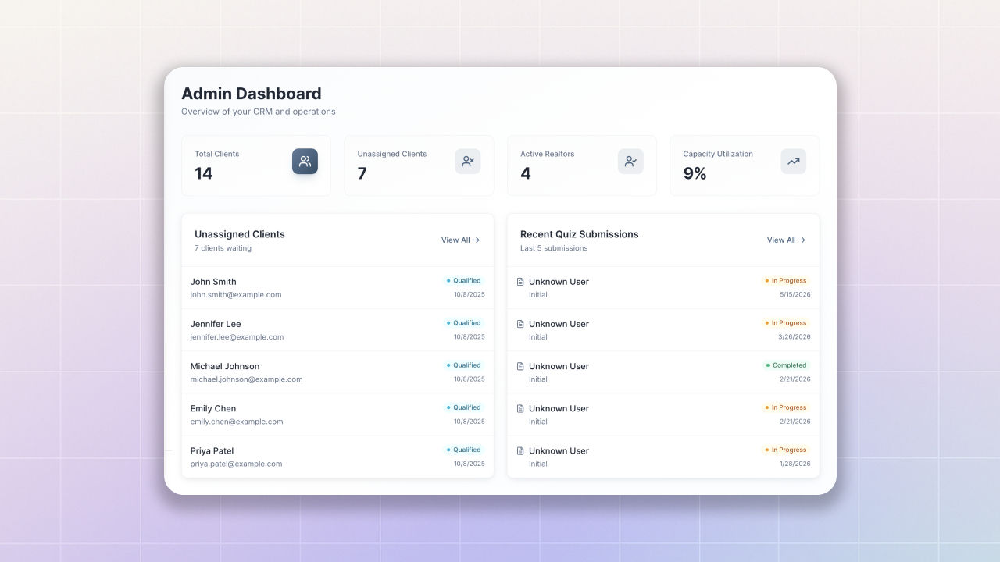
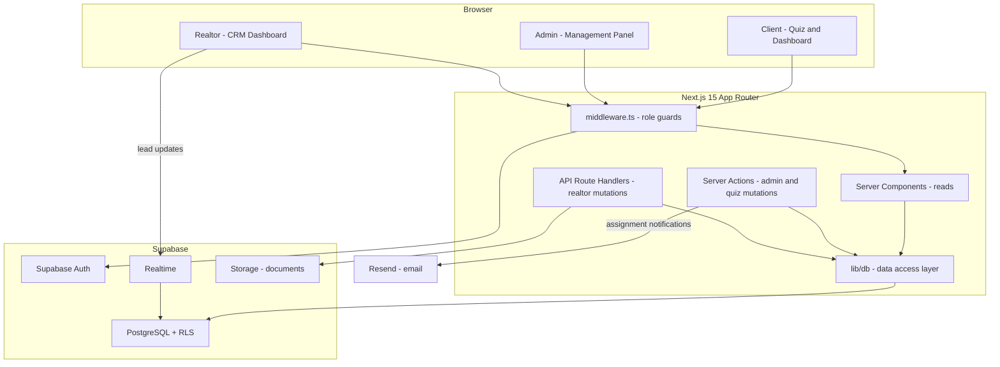
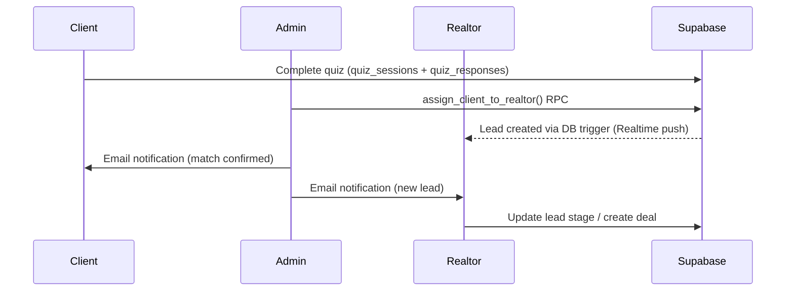

# Align

**A full-stack real estate agent-matching platform.** 

[](https://nextjs.org)
[](https://typescriptlang.org)
[](https://supabase.com)
[](https://tailwindcss.com)
[](https://vercel.com)

---

## Overview

Production: **Currently offline during updates**
Vercel (use for testing) : 

Align solves a specific gap in real estate: most platforms focus on property listings, but finding the *right agent* is often the harder problem. Align matches clients to agents based on their needs, preferences, and personality.

**Three user roles:**

| Role | What they do |
|------|-------------|
| **Client** | Takes a 9-section matching quiz; gets assigned to a realtor |
| **Realtor** | Receives pre-qualified leads; manages pipeline, deals, and appointments |
| **Admin** | Oversees all clients and realtors; handles assignments; monitors KPIs |

**Business model:** Clients use the platform for free. Realtors receive matched leads. Align earns a 10-35% referral fee on closed deals.

---

## Screenshots

Landing Page



Quiz Page



Realtor Dashboard



Admin Dashboard



---

## System Design



### Data flow — client to realtor



---

## Technical Architecture

- **Next.js 15 App Router** with React Server Components as the default. Client components are used only for interactive elements: Kanban DnD, modals, controlled forms, and Supabase Realtime subscriptions.
- **Two mutation patterns:** admin/quiz mutations use Next.js Server Actions (called directly from forms/components); realtor mutations use conventional REST route handlers under `app/api/`.
- **`lib/db/*` data access layer**: all Supabase queries are centralized in typed modules, never scattered across components.
- **Supabase RLS** enforces authorization at the database level. The middleware and layout redirects are a UX convenience on top, the DB will reject unauthorized queries regardless.
- **Assignment-sync trigger**: when an admin assigns a client, a Postgres trigger automatically creates a `leads` record in the realtor's pipeline, which Supabase Realtime delivers to the realtor's Kanban without a page refresh.
- **Immutable audit log**: every admin action is appended to `audit_logs` with actor, entity, and metadata. No update/delete policies on that table.
- **Quiz content in DB**:  sections, questions, options, and conditional visibility rules are stored in `quiz_*` tables and seeded via `npm run seed:quiz`. Content changes don't require a code deploy.

---

## Tech Stack

| Layer | Technology | Notes |
|-------|-----------|-------|
| Framework | [Next.js 15](https://nextjs.org) (App Router) | RSC-first, TypeScript |
| UI | [React 19](https://react.dev), [Tailwind CSS 3](https://tailwindcss.com), [shadcn/ui](https://ui.shadcn.com) | Radix UI primitives |
| Icons | [Lucide React](https://lucide.dev) | |
| Animation | [Framer Motion](https://www.framer.com/motion/) | |
| Forms | [React Hook Form](https://react-hook-form.com) + [Zod](https://zod.dev) | |
| Drag & Drop | [@dnd-kit](https://dndkit.com) | Realtor Kanban board |
| State | [Zustand](https://zustand-demo.pmnd.rs) | Lightweight client state |
| Database | [Supabase](https://supabase.com) (PostgreSQL) | RLS on all tables |
| Auth | Supabase Auth (`@supabase/ssr`) | Email + OTP, cookie sessions |
| Email | [Resend](https://resend.com) | Assignment notifications |
| Hosting | [Vercel](https://vercel.com) | Auto-deploy from `main` |
| Language | TypeScript 5 | Strict mode |

---

## Core Features

### Client
- Email/password signup with OTP email verification
- 9-section matching quiz with 45+ questions
- 11 question types: single/multi choice, text, number, money, address, yes/no, phone, email, date
- Conditional section visibility (questions adapt based on prior answers)
- Auto-save with 400ms debounce (quiz resumes exactly where left off)
- Mobile-optimized with sticky footer navigation and progress bar
- Dashboard shows matched realtor details after assignment

### Realtor
- Onboarding flow: profile completion + MSA digital signature
- Leads Kanban with drag-and-drop stage management (New, Working, Nurture, Client / Lost)
- Lead actions: set follow-up date, decline with reason, convert to CRM client
- Appointments management (create, view)
- Deals pipeline with property details and offer price
- CRM clients table
- Referral contracts and payouts
- Realtime lead delivery via Supabase subscriptions

### Admin
- KPI dashboard: client count, realtor count, utilization rate, work queues
- Full client management: list, detail view, status updates, notes
- Full realtor management: list, detail view, capacity, active toggle
- Assignment system: assign, reassign, and unassign clients with audit trail
- Quiz submission viewer with per-question answers and CSV export
- Bulk operations and work queues (unassigned clients, recent submissions)
- Immutable audit log of all admin actions

---

## Quick Start

### Prerequisites

- [Node.js](https://nodejs.org) 20+
- A [Supabase](https://supabase.com) project (free tier works)
- A [Resend](https://resend.com) account (optional: only needed for email notifications)

### 1. Clone and install

```bash
git clone https://github.com/YOUR_USERNAME/align-beta.git
cd align-beta
npm install
```

### 2. Configure environment variables

```bash
cp .env.local.example .env.local
```

Open `.env.local` and fill in your Supabase project URL and keys. More details in [Environment Configuration](#environment-configuration)

### 3. Run database migrations

Open the Supabase SQL Editor for your project and run these files **in order**:

```
1. SETUP.sql
2. seed/quiz.sql
3. migrations/admin-panel.sql
4. migrations/sync-profiles-triggers.sql
5. migrations/assignment-lead-sync.sql
```

See [DATABASE.md](./DATABASE.md) for the full migration reference.

### 4. Seed quiz questions

```bash
npm run seed:quiz
```

This populates the quiz tables with all 45+ questions.

### 5. Set your admin account

In the Supabase SQL Editor, after creating your account via the signup page:

```sql
UPDATE profiles SET role = 'admin' WHERE email = 'your@email.com';
```

### 6. Start the dev server

```bash
npm run dev
```

Visit [http://localhost:3000](http://localhost:3000).

---

## Development URLs

| URL | Role | Description |
|-----|------|-------------|
| `http://localhost:3000` | Public | Homepage / landing page |
| `http://localhost:3000/signup` | Public | Create a new account |
| `http://localhost:3000/login` | Public | Sign in |
| `http://localhost:3000/quiz` | Client | Start the matching quiz |
| `http://localhost:3000/dashboard` | Client | View match status |
| `http://localhost:3000/admin` | Admin | KPI dashboard |
| `http://localhost:3000/admin/clients` | Admin | Client management |
| `http://localhost:3000/admin/realtors` | Admin | Realtor management |
| `http://localhost:3000/admin/assignments` | Admin | Assignment management |
| `http://localhost:3000/admin/quizzes` | Admin | Quiz submission viewer |
| `http://localhost:3000/admin/audit` | Admin | Audit log |
| `http://localhost:3000/realtor` | Realtor | Realtor overview |
| `http://localhost:3000/realtor/leads` | Realtor | Leads Kanban |
| `http://localhost:3000/realtor/appointments` | Realtor | Appointments |
| `http://localhost:3000/realtor/deals` | Realtor | Deals pipeline |
| `http://localhost:3000/realtor/settings` | Realtor | Profile settings |

---

## Test Users

Use these accounts to explore each role. Use at [https://align-beta-aris-projects-f14c4a84.vercel.app/](https://align-beta-aris-projects-f14c4a84.vercel.app/).

| Role | Email | Password | Setup |
|------|-------|----------|-------|
| **Admin** | *ari@kolqua.com* | *ari123* | `UPDATE profiles SET role = 'admin' WHERE email = '...';` |
| **Realtor** | *realtor@kolqua.com* | *realtor123* | `UPDATE profiles SET role = 'realtor' WHERE email = '...';`, then complete onboarding |
| **Client** | *client@kolqua.com* | *client123* | Default role (make new account for test) |

See [docs/TESTING.md](./docs/TESTING.md) for detailed test flows.

---

## Development Commands

```bash
npm run dev          # Start local dev server
npm run build        # Production build
npm run start        # Run the production build locally
npm run lint         # ESLint check
npm run seed:quiz    # Seed quiz questions into the database
```

---

## Project Structure

```
align-beta/
├── app/                        # Next.js App Router
│   ├── _components/            # Shared UI (Button, Card, Input, Form)
│   ├── admin/                  # Admin dashboard pages + _actions.ts
│   ├── quiz/                   # Client quiz pages + _actions.ts
│   ├── realtor/                # Realtor CRM pages
│   ├── api/                    # REST route handlers
│   │   ├── auth/signout/
│   │   ├── quiz/structure/
│   │   └── realtor/            # leads, profile, appointments, clients, deals
│   ├── login/                  # Auth pages
│   ├── signup/
│   ├── verify-otp/
│   ├── forgot-password/
│   ├── reset-password/
│   └── dashboard/              # Role-based redirect hub
├── components/ui/              # shadcn/ui primitives
├── lib/
│   ├── db/                     # Database access layer (one module per domain)
│   ├── quiz/                   # Quiz types + conditional visibility logic
│   ├── email/                  # Resend email templates
│   ├── auth.ts                 # Auth helpers + UserRole type
│   ├── supabaseClient.ts       # Browser Supabase client
│   ├── supabaseServer.ts       # Server Supabase client (cookie sessions)
│   └── utils.ts                # General utilities
├── migrations/                 # SQL migration files
├── seed/                       # Quiz definition JSON + quiz.sql
├── scripts/                    # seed-quiz.ts utility script
├── public/                     # Static assets
├── docs/                       # Extended documentation
│   ├── API.md                  # API reference (REST routes + server actions)
│   ├── TESTING.md              # Manual QA guide
│   ├── ARCHITECTURE.md         # Deep-dive architecture and business model
│   └── screenshots/            # App screenshots
├── SETUP.sql                   # Core profiles table + auth triggers
├── DATABASE.md                 # Full database schema reference
├── middleware.ts               # Route protection by role
├── .env.local.example          # Environment variable template
└── package.json
```

---

## Security

| Mechanism | Where |
|-----------|-------|
| **Row Level Security (RLS)** | All Supabase tables — enforces per-role data isolation at the DB level |
| **Middleware role guards** | `middleware.ts` — redirects unauthenticated/wrong-role requests before rendering |
| **Layout-level role checks** | `app/admin/layout.tsx`, `app/realtor/layout.tsx` — secondary guard layer |
| **Cookie-based sessions** | `@supabase/ssr` — session stored in HTTP-only cookies, not localStorage |
| **SECURITY DEFINER functions** | Admin RPCs and triggers run with elevated privileges without exposing service role key to the client |
| **Immutable audit log** | `audit_logs` table has no update/delete RLS policies |
| **Explicit session checks** | `sign-msa` and `convert-to-client` route handlers verify session independently |

**Note:** Several realtor mutation routes (`update-stage`, `decline`, `set-next-touch`, etc.) rely on Supabase RLS for authorization rather than an in-handler session check. The database will reject any unauthorized query. This is intentional and consistent with Supabase's recommended pattern.

---

## Deployment Options

### Vercel

1. Push the repo to GitHub.
2. Import the project in the [Vercel dashboard](https://vercel.com/new).
3. Add the environment variables from `.env.local.example`.
4. Add your production domain to Supabase Auth.
5. Deploy. Vercel auto-deploys on every push to `main`.

### Self-hosted (Node.js)

```bash
npm run build
npm run start         # Listens on port 3000 by default
```

---

## Environment Configuration

Copy `.env.local.example` to `.env.local` and fill in your values:

| Variable | Required | Description |
|----------|----------|-------------|
| `NEXT_PUBLIC_SUPABASE_URL` | Yes | Your Supabase project URL |
| `NEXT_PUBLIC_SUPABASE_ANON_KEY` | Yes | Supabase anon/public key |
| `SUPABASE_SERVICE_ROLE_KEY` | Seed only | Service role key — used by `npm run seed:quiz` only |
| `RESEND_API_KEY` | Optional | Resend API key for assignment email notifications |
| `NEXT_PUBLIC_APP_URL` | Optional | App base URL for email links (defaults to `http://localhost:3000`) |

---

## Documentation

| Document | Description |
|----------|-------------|
| [docs/API.md](./docs/API.md) | Full API reference: all 12 REST route handlers, admin server actions, quiz server actions, and client-side auth flows |
| [docs/TESTING.md](./docs/TESTING.md) | Manual QA guide: step-by-step test flows for all three roles, auth edge cases, regression matrix |
| [DATABASE.md](./DATABASE.md) | Complete database schema: all tables, columns, RLS policies, ER diagram, migration order |
| [docs/ARCHITECTURE.md](./docs/ARCHITECTURE.md) | Architecture deep-dive: business model, design decisions, data patterns, roadmap |

---

## Troubleshooting

**Quiz loads but has no questions**

Run `npm run seed:quiz`. The quiz tables exist but haven't been populated yet.

**Redirected to `/dashboard` instead of `/admin` or `/realtor`**

Your account's role in the `profiles` table is `client`. Run the SQL to update it:
```sql
UPDATE profiles SET role = 'admin' WHERE email = 'your@email.com';
-- or
UPDATE profiles SET role = 'realtor' WHERE email = 'your@email.com';
```

**`Error: supabase URL is required`**

`.env.local` is missing or the variable names don't match `.env.local.example`. Make sure `NEXT_PUBLIC_SUPABASE_URL` is set (the `NEXT_PUBLIC_` prefix is required for client-side access).

**Realtor sees no leads after admin assignment**

Check that `migrations/assignment-lead-sync.sql` was applied. The trigger in that file creates the `leads` record when an assignment is made.

**Assignment emails are not arriving**

Verify `RESEND_API_KEY` is set in `.env.local`. Check that your Resend sender domain is verified. Email failures are non-blocking — assignments still succeed even if email sending fails; check console logs for error details.

**Supabase auth redirect error in production**

Add your production domain to Supabase Auth → URL Configuration → Redirect URLs (e.g. `https://yourdomain.com/**`).

**`npm run build` fails with TypeScript errors**

Run `npm run lint` first to identify issues. Common causes: missing environment variable types, or out-of-date `package-lock.json` (run `npm install`).

---

## Project Status

**Status: MVP — production paused**

| Area | Status |
|------|--------|
| Auth system | Complete |
| Client matching quiz | Complete |
| Admin dashboard | Complete |
| Realtor CRM | Complete |
| Email notifications | Complete |
| Automated test suite | Not yet implemented |
| Matching algorithm | Planned |
| SMS notifications | Planned |
| Stripe / payout processing | Planned |

See [docs/ARCHITECTURE.md#roadmap](./docs/ARCHITECTURE.md#roadmap) for the full phased roadmap.

---

## Credits

Built by [ar1shah](https://github.com/ar1shah). Licensed under the [MIT](./LICENSE)
